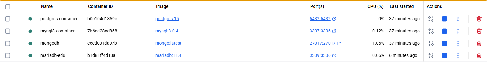

<a href="../ReadMe.md" style="float:right;">🏠Home</a><a id="top"></a>

# 🐳Docker Run Code List

---

## 📜현재 도커 리스트



>2025-09-26

---

### 🐘PostgreSQL
```
docker run -d `
  --name postgres-container `
  -e POSTGRES_USER=testuser `
  -e POSTGRES_PASSWORD=testpw `
  -e POSTGRES_DB=test123 `
  -p 5432:5432 `
  -v pgdata:/var/lib/postgresql/data `
  postgres:15
```

### 🍃MongoDB
```
docker run -d `
  --name mongodb `
  -e MONGO_INITDB_ROOT_USERNAME=admin `
  -e MONGO_INITDB_ROOT_PASSWORD=1234 `
  -p 27017:27017 `
  mongo:latest
```

### 🐬MySQL
```
docker run -d `
  --name mysql8-container `
  -e MYSQL_ROOT_PASSWORD=1234 `
  -e MYSQL_DATABASE=testdb `
  -e MYSQL_USER=testuser `
  -e MYSQL_PASSWORD=testpw `
  -p 3307:3306 `
  -v mysql_data:/var/lib/mysql `
  mysql:8.0.4
```

---

### 🦦MariaDB
```
docker volume create mariadb_edu

docker run -d `
  --name mariadb-edu `
  -p 3309:3306 `
  -e MARIADB_ROOT_PASSWORD=yourRootPass `
  -e MARIADB_DATABASE=devdb `
  -e MARIADB_USER=dev `
  -e MARIADB_PASSWORD=devpass `
  -v mariadb_edu:/var/lib/mysql `
  mariadb:11.4
```
> `local`에서 `3308`포트를 쓰고있기 때문에 분리를 위해 `3309`포트로 매핑


<a href="#top" style="display:block; text-align:right; text-decoration:none; font-size:14px;">⬆️ 맨 위로</a>