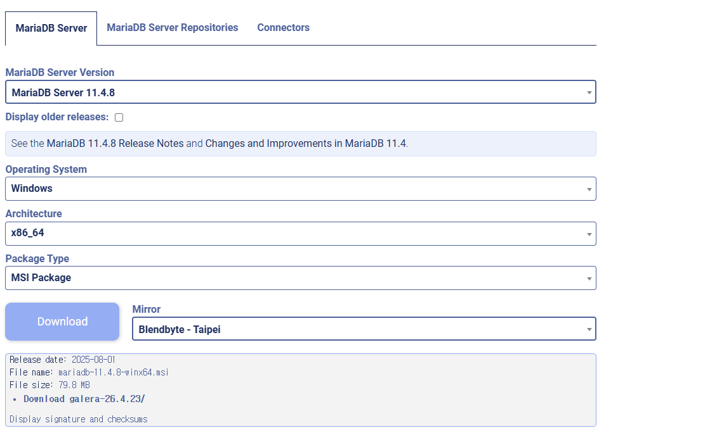
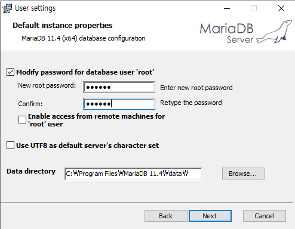
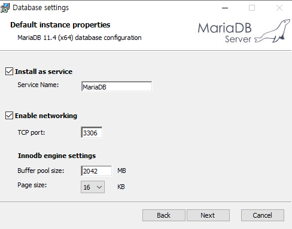

<a href="../ReadMe.md" style="float:right;">🏠Home</a><a id="top"></a>

# 📥Download Page

--- 

## 🐿️DBeaver
## 설치 링크
**Link : https://dbeaver.io/download/**  

  
>링크에 들어가서 위 사진처럼 `installer`로 되어있는것 클릭해서 설치


  
**이후 위 화면이 나오면 개인 PC기준 `아래[For me(JuHn)]` 추천**  
>위는 PC 안에 있는 모든 계정(사용자)에서 DBeaver를 사용할 수 있도록 설치(관리자 권한 필요할 수 있음)

  


**넘어가면 위 화면이 나오는데 그대로 다음**  
```java
* 체크박스 설명
- DBeaver Community: 본체 프로그램 (필수)
- Include Java: DBeaver 실행에 필요한 Java Runtime 포함 (보통 체크 권장, 따로 JDK/JRE 안 깔아도 됨)
- Reset Settings: 이전에 설치한 설정(테마, 연결 정보 등)을 초기화할 때 사용(새로 설치라면 필요 없음)
- Associate SQL files: .sql 파일을 더블클릭하면 DBeaver에서 열리도록 연결
- Associate SQLite database files: .sqlite 파일을 더블클릭하면 DBeaver에서 열리도록 연결
```

  
**설치 경로 설정 화면`현재 집에서 DB폴더로 DB관련된 소프트웨어 모아서 관리하기 위해 위처럼 경로설정`**  


시작메뉴에 바로가기 만들것인지 선택하는 화면(깔끔하게 하기위해 `DBeaver Community > DBeaver`로 변경)

>이후 마지막 화면에 Create Desktop Shortcut 이라는 체크박스는 바탕화면 바로가기 만들것인지 여부

---

## 🐳Docker

**Link : https://www.docker.com/products/docker-desktop**
> Windows 10 Pro 이상 → Hyper-V / Home → WSL2 필요  
> 설치 후 재부팅 → 작업표시줄에 🐳 아이콘 확인  

  
**위 화면에서 `Download for Windows - AMD64`로 선택후 다운로드**  
>"AMD64"는 AMD CPU만 지원하는 게 아니고,Intel CPU(64bit)도 포함하는 일반적인 x64 아키텍처를 의미하기 때문에 대부분 저 옵션으로 선택하면 됨.


**위 화면에서는 기본값으로 두고 바로 OK 클릭**  
```java
* 체크박스 설명
Use WSL 2 instead of Hyper-V (recommended)
- 기본적으로 Docker Desktop은 WSL2를 권장합니다.
- WSL2는 가볍고 빠르며 Windows Home에서도 사용 가능.
- ✅ 체크 그대로 두세요 (추천).
Allow Windows Containers to be used with this installation
- Windows용 네이티브 컨테이너 기능을 켜는 옵션입니다.
- 주로 리눅스 기반 컨테이너만 쓰게 될 거라서 굳이 필요 없음.
- ❌ 보통 체크 안 합니다.
Add shortcut to desktop
- 바탕화면에 바로가기 아이콘 만들기.
- ✅ 체크해두면 편합니다.
```

```java
Close and restart 버튼 클릭
- 윈도우를 재부팅해야 Docker Desktop이 정상적으로 동작
재부팅 후
- 바탕화면 아이콘이나 시작 메뉴에서 Docker Desktop 실행
- 처음 실행 시 WSL2 관련 업데이트나 Docker Hub 로그인 화면이 뜰 수 있음
- 계정이 없으면 Docker Hub에서 무료 가입 후 로그인
```

**위 화면은 사용권 동의(Subscription Service Agreement) 창**  
- 개인이 공부/개발 용도로 쓰는 경우에는 무료(Community Edition) 입니다.
- 기업(직원 250명 이상 또는 매출 1천만 달러 이상)만 유료 요금제(Pro/Team/Business) 필요해요.
👉 따라서 그냥 `Accept` 클릭하면 됨  


`Accept`클릭 후 화면

**로그인 후 오류화면**
>WSL(Windows Subsystem for Linux) 버전이 오래돼서 Docker Desktop이 실행이 안 된다는 메시지

**해결방법**
1. **PowerShell을 관리자 권한으로 실행**
2. **아래 명령어 입력:**
```sql
wsl --update
```
>최신 WSL 커널로 업데이트합니다.
3. **업데이트가 끝나면 재부팅(아래 명령어 입력):**
```sql
wsl --shutdown
```
4. **다시 Docker Desktop 실행 → 이제 정상적으로 올라와야 함**

**참고**
만약 wsl 명령어 자체가 안 된다면 `WSL` 설치가 안 된 상태일 수 있음 그럴 때:
```sql
wsl --install
```
을 실행하면 자동으로 `WSL2 + Ubuntu` 설치.`(Windows 10 최신 업데이트 필요)`


**정상실행화면**
- 이제는 WSL(리눅스 하위 시스템) 이 제대로 업데이트되어서 `Docker Desktop`이 실행된 상태  
- 왼쪽 아래 `Engine running`(고래 아이콘 옆에 초록불) 표시 → 도커 엔진이 정상 작동 중이라는 뜻


## 설치 확인 및 실행

**설치 확인**
```sql
docker --version
예시: Docker version 27.0.3, build a878d
```
**테스트 실행**
```sql
docker run hello-world
```
"Hello from Docker!" 나오면 정상 설치 완료

**MySQL 실행 예시(설치했을 경우)**
```sql
docker run -d --name mysql8-container `
  -e MYSQL_ROOT_PASSWORD=1234 `
  -p 3307:3306 `
  mysql:8.0
```
**실행 확인**
```sql
docker ps
docker exec -it mysql8-container mysql -u root -p
>>(root 비번: 1234)
```

---

## 🐬MySQL


## 로컬 설치 링크(현재 집에선 Docker로만 설치해서 추후 업데이트 예정)
**Link : https://dev.mysql.com/downloads/installer/**
```
MySQL Installer (윈도우 GUI 방식 - 로컬)

가장 초보자 친화적인 방법입니다.

공식 다운로드
 접속

MySQL Installer for Windows (Community Edition) → 32bit/64bit 모두 지원

mysql-installer-community-<버전>.msi 파일 받기

설치 실행 후 옵션 선택

Developer Default → 서버 + Workbench + 샘플 DB 같이 설치

Server only → 서버만

환경설정 진행

포트: 기본 3306 (중복 시 3307, 3308 등으로 변경 가능)

인증 방식: Use Strong Password Encryption (MySQL 8.0 Recommended)

root 계정 암호 설정

필요 시 사용자 계정 추가

설치 완료 후 확인

Windows Service 등록됨 (자동 실행)

mysql -u root -p 로 접속 테스트
```

---

## 🐘PostgreSQL

## 설치 링크
**Link : https://www.postgresql.org/download/**


>위 화면에서 환경에 맞는것 선택(현재 `Windows`사용중이라 `Windows`기준)


---

## 🦦MariaDB

## 설치 링크
**Link : https://mariadb.org/download/**

### 다운로드 설정 예시(현재 사용중인 패키지 설정)


> 수업에 사용된 버전 `11.4.8`


**옵션 설정**
```
- 설치 경로: 기본값(C:\Program Files\MariaDB 11.4\) 유지 권장
- root 비밀번호: 꼭 입력하고 잘 메모 (현재 - 123456)
- 포트 번호: 기본값 3306 그대로 사용(이미 사용중이라면 +1씩 늘려가기 / 현재 local port - 3308)
- 서비스 등록: Windows 시작 시 자동 실행 옵션 체크
```


## 설치창 설명 및 추천 체크 항목



**추천 설정**
- root 비밀번호: 원하는 비밀번호 입력 후 확인
- Enable access...: 체크 ❌
- Use UTF8...: 체크 ⭕
- Data directory: 기본값 유지

**각 항목 설명**

1. Modify password for database user 'root'
-체크된 상태 유지하세요 (필수).
-`New root password`와 `Confirm`에 같은 비밀번호 입력 → 앞으로 DB 접속할 때 쓰이는 관리자 비밀번호입니다.
-⚠ 꼭 기억해두세요. 잊으면 접속 못합니다.

2. Enable access from remote machines for 'root' user
-기본적으로 체크 해제 상태 유지 권장.
-로컬에서만 공부/개발할 거라면 그대로 두시면 됩니다.
-만약 외부 PC에서 접속해야 한다면 나중에 MySQL 권한 설정으로 열어줄 수 있어요.

3. Use UTF8 as default server's character set
-가능하면 체크하세요 ✅.
-한국어 데이터 다룰 때도 문제 없고, 기본 문자셋이 UTF-8로 지정됩니다.

4. Data directory
-데이터 저장 위치. 기본값(C:\Program Files\MariaDB 11.4\data\) 그대로 두면 됩니다.
-특별히 다른 드라이브에 설치하고 싶지 않으면 건드릴 필요 없습니다.



**추천 설정**
- `Install as service`: 체크 ⭕ (MariaDB 자동 실행)
- `Enable networking`: 체크 ⭕, 포트 `3306` 유지 (현재 `3308`)
- `Innodb engine`: 기본값 유지

**각 항목 설명**

1. Install as service
-✅ (기본값 유지)
-이렇게 해야 Windows 시작 시 자동으로 MariaDB 서버가 실행됩니다.
-`Service Name: MariaDB` 그대로 두면 됩니다.
2. Enable networking
-✅ (기본값 유지)
-TCP 포트: `3306` → 기본값 그대로 추천(현재 수업받는 내용 진행중 `3306`포트 사용중이라 `3308`로 변경)
-나중에 DBeaver, VSCode, Node.js 같은 클라이언트에서 이 포트로 접속합니다.
3. Innodb engine settings
-Buffer pool size: 설치 프로그램이 PC 메모리 용량에 따라 자동으로 추천값을 줍니다. 그대로 두시면 됩니다.
-Page size: `16KB` 기본값 그대로 두세요.


## 설치 완료 후 확인

### 서비스 실행 확인
**MariaDB는 Windows 서비스로 실행됩니다.**
1. **`Win + R`** → `services.msc` 입력 (시스템창)
2. 목록에서 `MariaDB` 찾아서 실행 상태 확인
- `실행 중(Running)`이면 정상
- 아니면 **우클릭 → 시작(Start)**

### 명령어로 접속 확인
1. `CMD` 또는 `PowerShell` 열기
2. 접속 시도:
```sql
mysql -u root -p -P 3308
```
- `-u root`: root 계정
- `-p`: 비밀번호 입력 모드
- `-P 3308`: 설치할 때 지정한 포트 번호 (`3306`이 아니라면 꼭 맞춰야 함! 현재 `3308`)
3. 설치 시 입력한 root 비밀번호 입력(현재 기준 : 123456) → 접속 성공하면 `MariaDB [(none)]>` 프롬프트가 뜹니다.

---


<a href="#top" style="display:block; text-align:right; text-decoration:none; font-size:14px;">
⬆️ 맨 위로
</a>