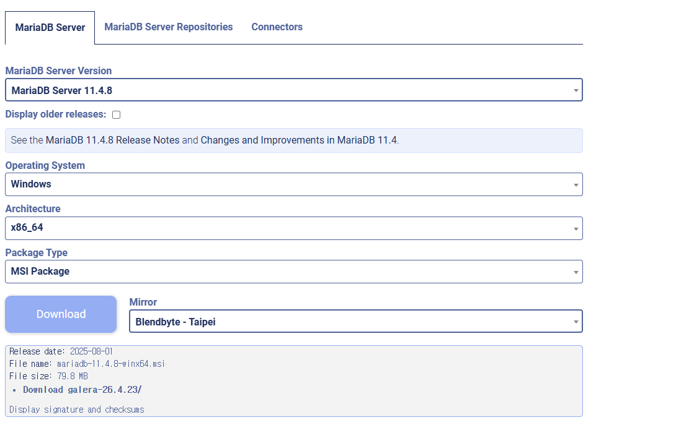

<a href="../ReadMe.md" style="float:right;">🏠Home</a><a id="top"></a>

# 📥Download Page

--- 

## 🐿️DBeaver
## 설치 링크
**Link : https://dbeaver.io/download/**  
>링크에 들어가서 아래 사진처럼 `installer`로 되어있는것 클릭해서 설치

  

---

## 🐳Docker
### Docker 설치 & 확인 (Windows)

## 설치 링크
**Link : https://www.docker.com/products/docker-desktop**
- Windows 10 Pro 이상 → Hyper-V / Home → WSL2 필요  
- 설치 후 재부팅 → 작업표시줄에 🐳 아이콘 확인  


## 설치 확인 및 실행

**설치 확인**
```sql
docker --version
예시: Docker version 27.0.3, build a878d
```
**테스트 실행**
```sql
docker run hello-world
```
"Hello from Docker!" 나오면 정상 설치 완료

**MySQL 실행 예시**
```sql
docker run -d --name mysql8-container `
  -e MYSQL_ROOT_PASSWORD=1234 `
  -p 3307:3306 `
  mysql:8.0
```
**실행 확인**
```sql
docker ps
docker exec -it mysql8-container mysql -u root -p
>>(root 비번: 1234)
```

---
## 🦦MariaDB

## 설치 링크
**Link : https://mariadb.org/download/**



> 수업에 사용된 버전 `11.4.8`

**옵션 설정**
```
- 설치 경로: 기본값(C:\Program Files\MariaDB 11.4\) 유지 권장
- root 비밀번호: 꼭 입력하고 잘 메모 (현재 - 123456)
- 포트 번호: 기본값 3306 그대로 사용(이미 사용중이라면 +1씩 늘려가기 / 현재 local port - 3308)
- 서비스 등록: Windows 시작 시 자동 실행 옵션 체크
```
**설치 완료 후 확인**
1. 윈도우 검색창 → CMD 열기
2. 접속 확인:
```sql
mysql -u root -p
```
3. 아까 설정한 root 비밀번호 입력(현재 기준 : 123456) → 접속되면 성공


<a href="#top" style="display:block; text-align:right; text-decoration:none; font-size:14px;">
⬆️ 맨 위로
</a>