# SQL Developer

## 설치링크

**Link : https://www.oracle.com/database/sqldeveloper/technologies/download/**

>접속하면 위화면

>스크롤 내리면 현재 화면

>캡쳐된 부분 설치

>압축 풀고 위처럼 exe파일 우클릭해서 바탕화면에 바로가기 만들기(편의성)

>실행시켜보면 아직 오라클 설치 전이라 위처럼 오류나옴

>아니오 클릭시 위처럼 실행은 됨

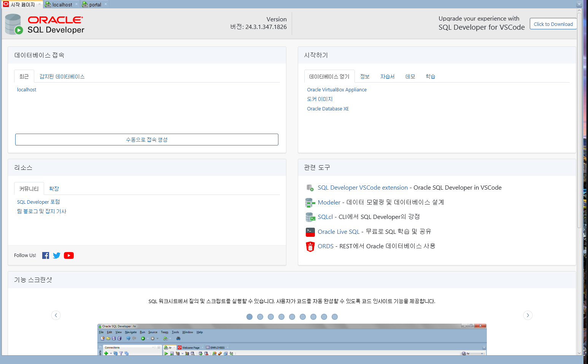
>수동으로 접속 생성

---

## 명령어로 실행하기 `명령 프롬프트(cmd) 열고: dbca 실행`
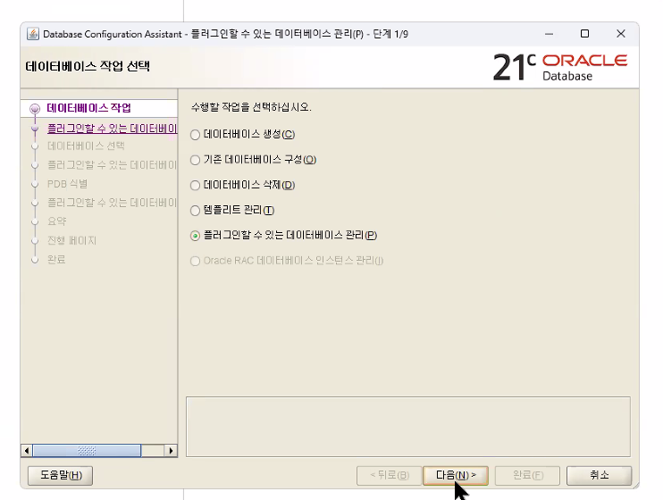
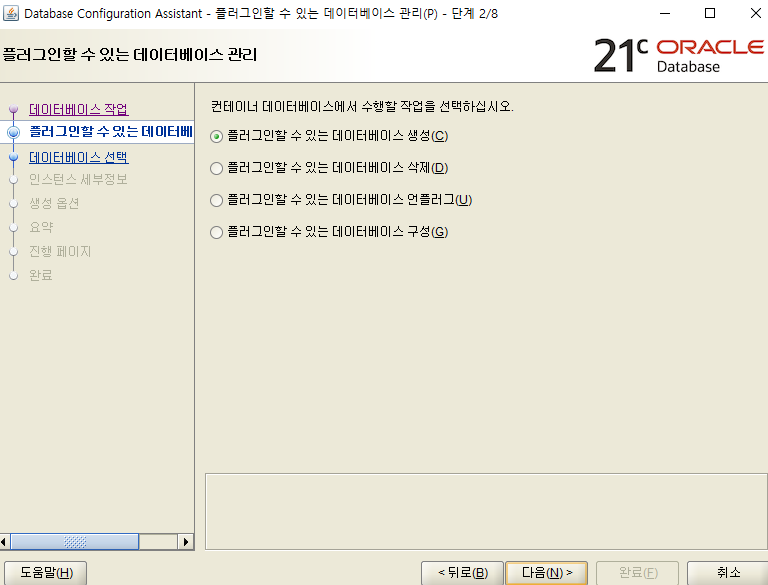
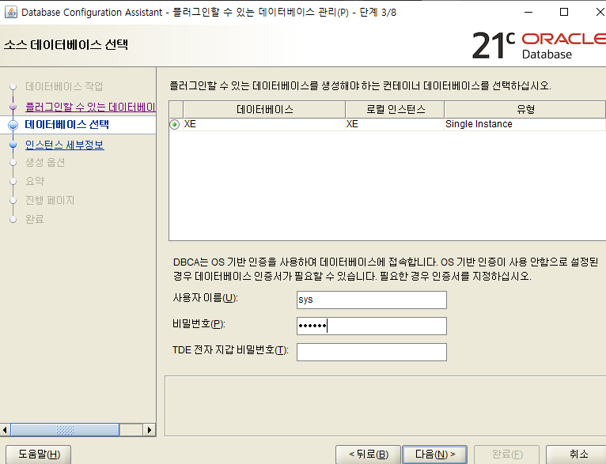
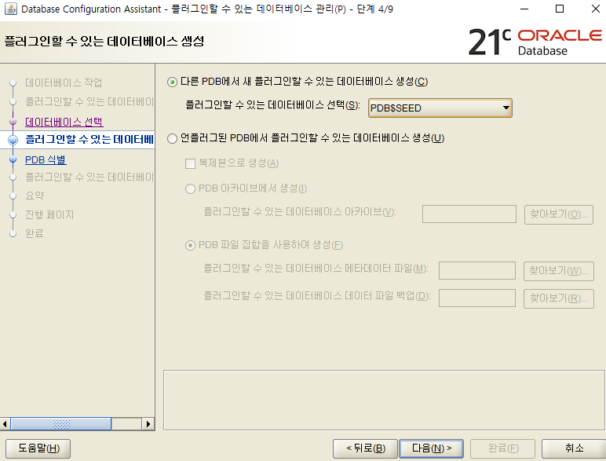
### sys / 123456 / 123456

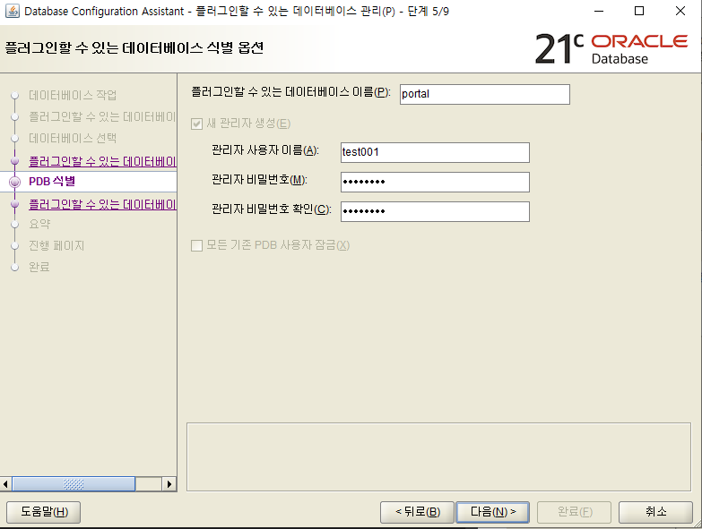
### test001 / test001 / test001
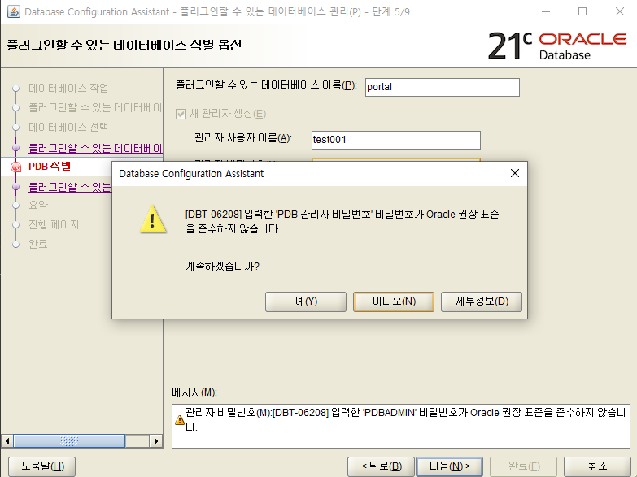
### 예
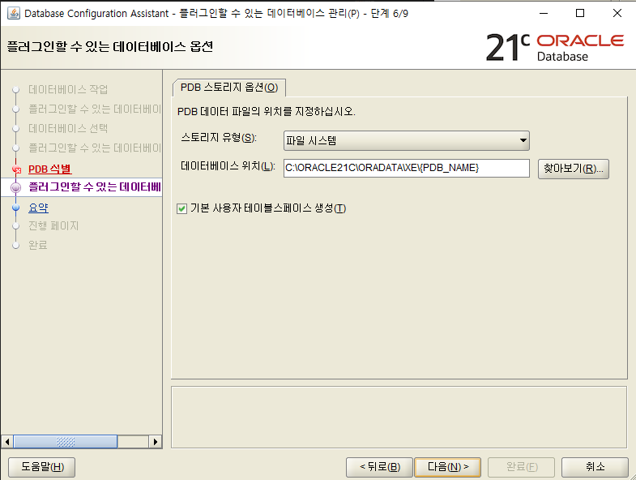
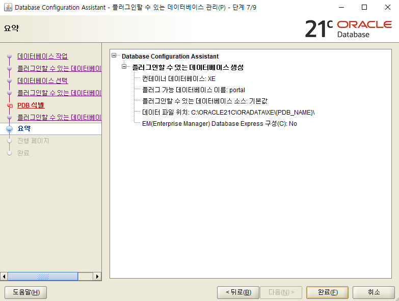
### 완료

## SQLDeveloper 실행 후 
좌측 상단에 oracle접속 위에 초록색 + 버튼 클릭
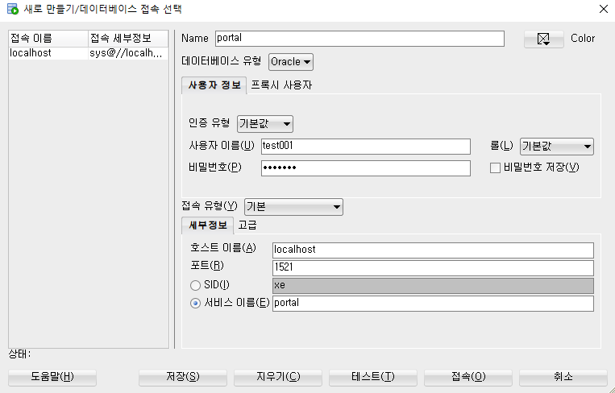
비밀번호 test001
이후 테이블생성할때 권한 오류 뜨면

똑같이 좌측 상단에 oracle접속 위에 초록색 + 버튼 클릭
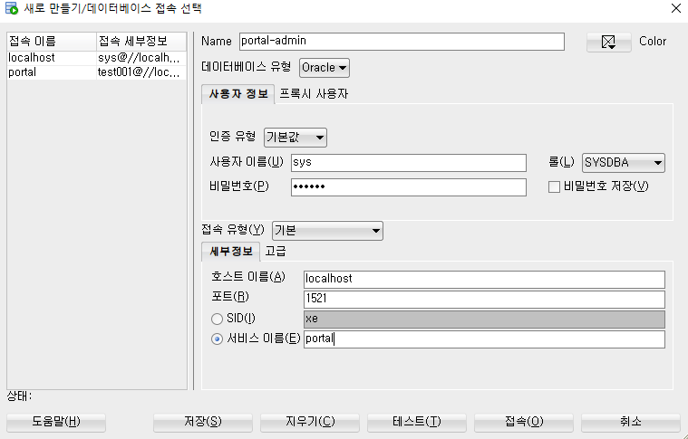
이렇게 admin 만들어서 `grant create session, create table to test001` 이 코드 편집기에 입력해서 권한주기 이후 이전에 생성한 portal에 테이블 생성 가능

---

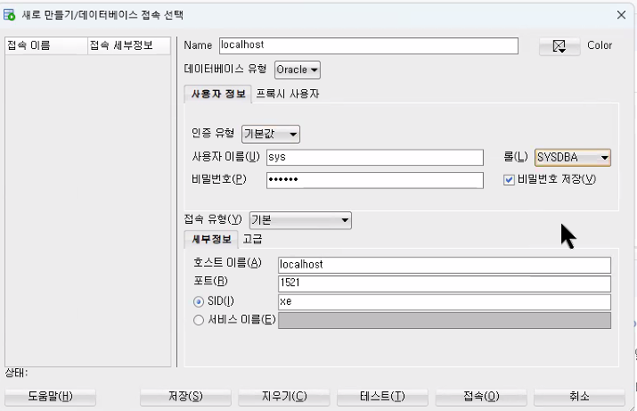
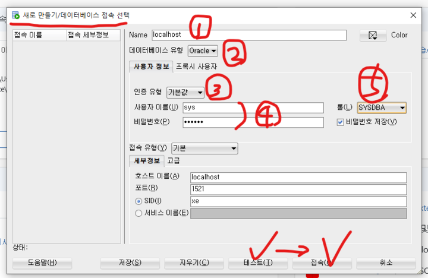
슈퍼어드민

**새 SQL 워크시트 : Alt + F10**

## 새 테이블 만들기
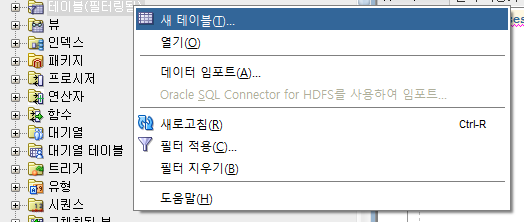
`새 테이블` 선택
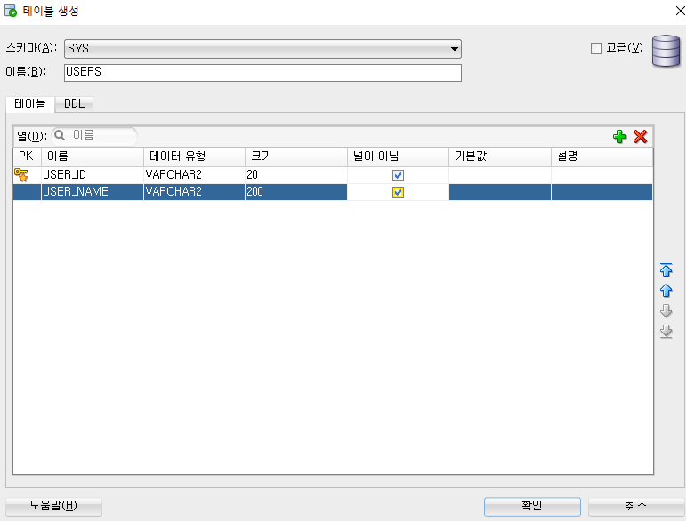

## 새 뷰 만들기
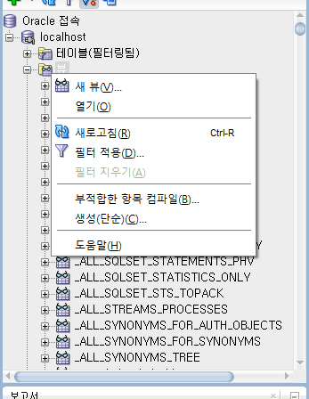
`새 뷰` 선택
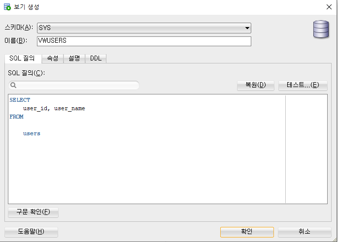
테스트 > 확인

## 새 인덱스 만들기
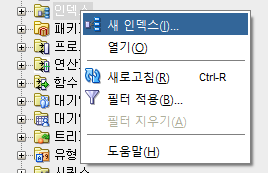
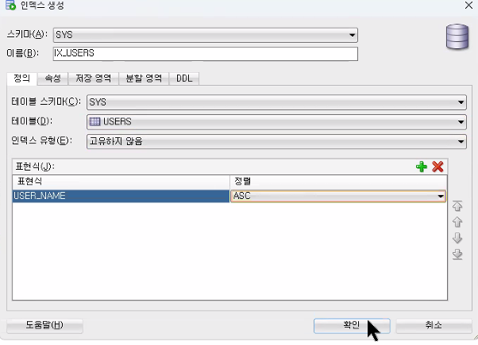

---

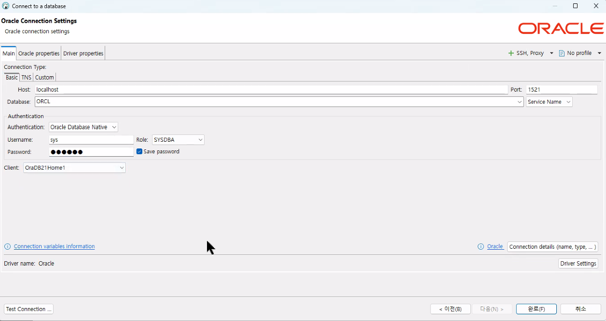
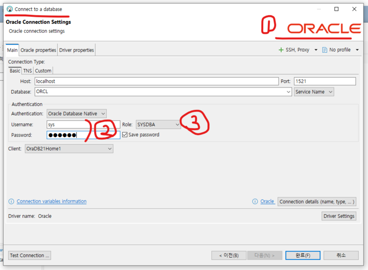
디비버에서 열기