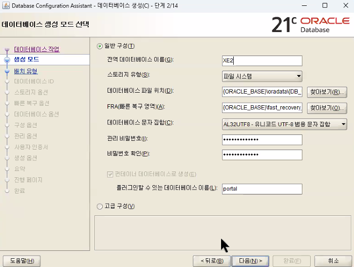
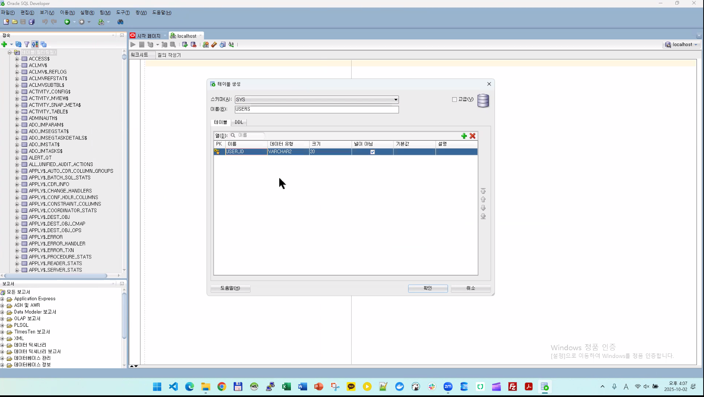
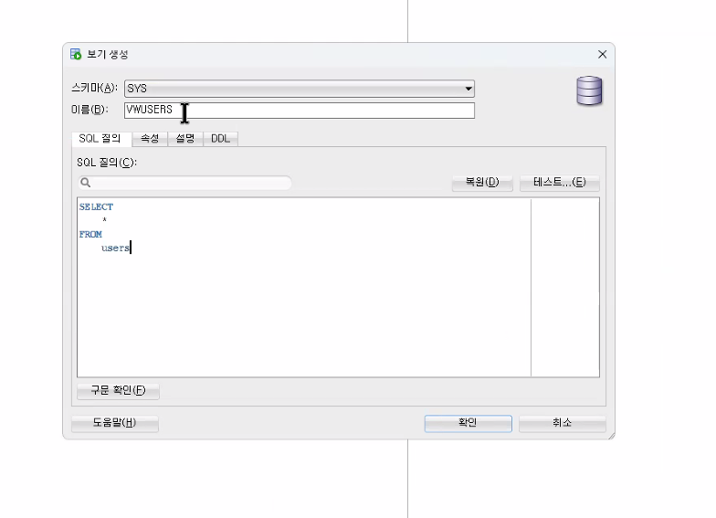
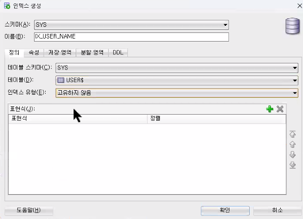
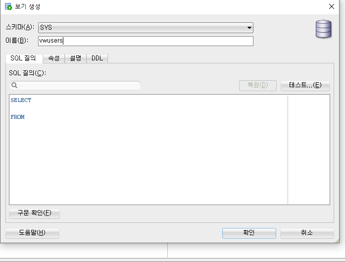
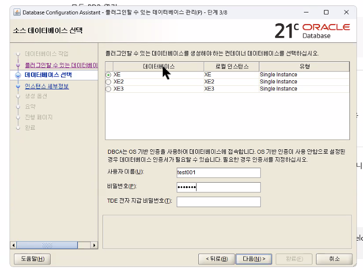

# SQL Developer


## 설치링크

**Link : https://www.oracle.com/database/sqldeveloper/technologies/download/**


>접속하면 위화면


>스크롤 내리면 현재 화면


>캡쳐된 부분 설치


>압축 풀고 위처럼 exe파일 우클릭해서 바탕화면에 바로가기 만들기(편의성)


>실행시켜보면 아직 오라클 설치 전이라 위처럼 오류나옴


>아니오 클릭시 위처럼 실행은 됨


---

수동으로 접속 생성


슈퍼어드민

**새 SQL 워크시트 : Alt + F10**


디비버에서 열기



??? [비밀번호 규제 강력 `대문자``소문자``숫자``특문`]비밀번호/비밀번호 확인 - 
>중도포기 - 사유 : 메모리부족




첫줄
```
insert into users values('a001', '한글')
```


`새 뷰` 선택

테스트 > 확인








명령어로 실행하기
명령 프롬프트(cmd) 열고:

dbca




sys / 123456 / 123456

test001 / test001 / test001

예


완료


비밀번호 test001


admin 만들어서
grant create session, create table to test001 이거 입력해서 권한주기 이후 portal 테이블 생성 가능

